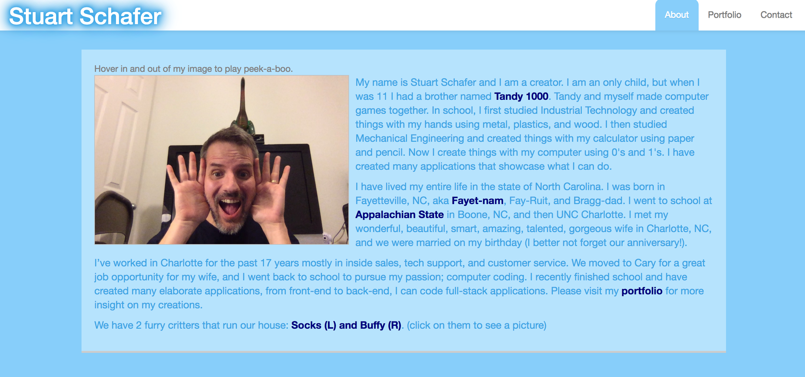
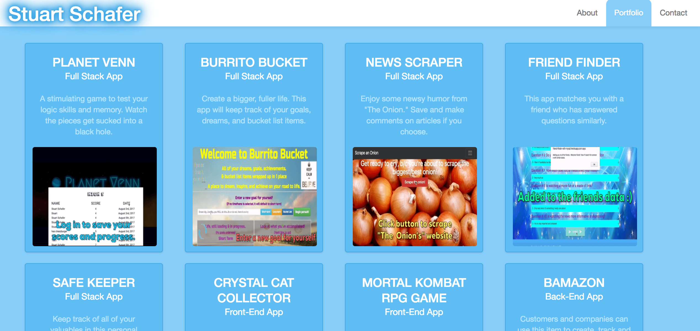

# Stuart Schafer's Portfolio #

To visit my site, please click on https://stuartschafer.github.io/Portfolio/

This is a detailed and complete experience about **who I am**, **what I've done**, and how to **get a hold of me**.  AND, my resume can be viewed [here](https://stuartschafer.github.io/Portfolio/resume.html).

## About Me (Who am I?) ##

The [About me](https://stuartschafer.github.io/Portfolio/index.html) page tells a story of how I got to be where I am, and some insights to who exactly I am.

## Portfolio (A collection of projects I have created) ##

My [Portfolio](https://stuartschafer.github.io/Portfolio/portfolio.html) page shows several applications that I've built from **Front-End** only (client side), **Back-End** only (server side), to **Full Stack** (both server and client).
2 of these projects I was part of a team (Venn Planet and SafeKeeper), and the rest I created by myself.

The cards on the portfolio page are interactive.  Hover over a card to see more info and clicking on a technology will give you more information about it. *(NOTE: on touch-screens, please tap on a card to view the front/back)*.

## What I Bring ##
I am a versitlie team player and can do whatever is needed.  Working on a team showed me that I can work on any/all aspects of a project as well as delegate to others what needs to be done.  I happily coded what was needed when I was assigned duties, and appointed chores to others when I saw fit.

Please let me know any feedback you have, contact me to discuss future endeavors, or just drop me a note to say "Hey!".  I love to chat with others, especially about code.
Contact me @ stuart_schafer@hotmail.com or on my [contact page](https://stuartschafer.github.io/Portfolio/contact.html).

**THANK YOU** for taking time to learn more about me and what I can do.